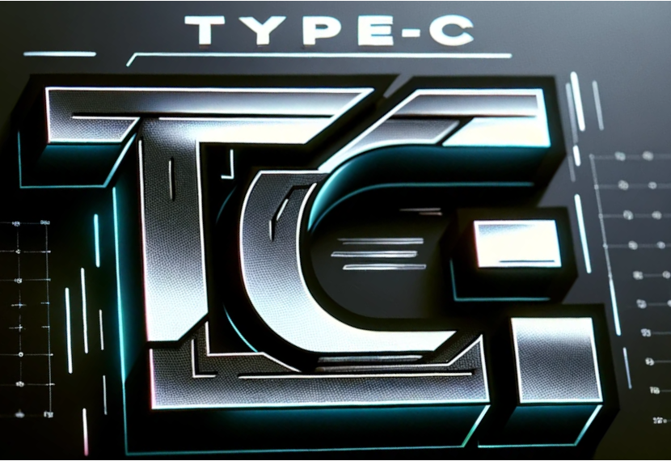

Type-C
===

<table>
    <tr>
        <td>
            

                
            

        </td>
    </tr>
    <tr>
        <td>
            

                

Type-C is a expressive programming language with emphasis on type safety and run-time performance. This repo hosts the type-c compiler which is written in TypeScript. The goal is to have a self hosted compiler in the future, however Type-V will always be written in C.
                

            

        </td>
    </tr>
</table>

How to run:
1. Clone the repo
3. Clone Type-C Standard Library: `https://github.com/project-type/stdlib`
4. Clone & Build Type-V: `https://github.com/project-type/type-v`
5. Configure runtime path and standard library paths
6. Install dependencies: `npm install`  
7. Build: `npx tsc`
8. Run Tests: `node outs/index.js --run-tests`
9. Run your own code: `node outs/index.js --c <path-to-your-code>`, use `--help` for more info