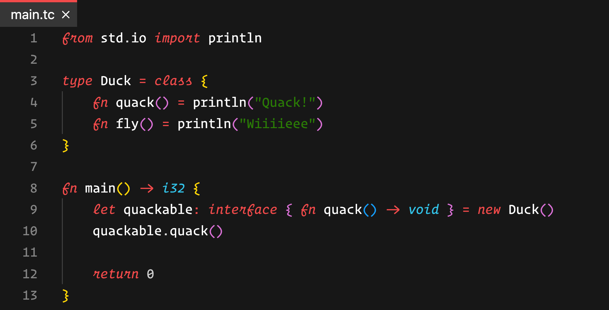

<br/>

<hr/>

Type-C is an expressive multi-paradigm programming language with emphasis on type safety and run-time performance. This repository contains the Type-C compiler, which can be installed by cloning this repo or installing it via npm (in progress).

For the Virtual Machine, please refer to the [Type-V Project](https://github.com/unlimitedsoftwareworks/type-v)

## Show some code!


## Getting started:

Setting up Type-C requires the following steps:
1. Installing Type-C source/npm
2. Installing the Type-V VM & building it from source
3. Installing the Type-C standard library

To get started, please have a look at the documentation: [https://typec.praisethemoon.org/docs/getting-started](https://typec.praisethemoon.org/docs/getting-started)

## CLI Usage:
After installing type-c either via npm `npm install -g @unlimitedsoftwareworks/type-c` or by cloning this repo, you can use the `type-c` command to compile your code.

```bash
Type-c compiler, version ${compilerVersion}.
Usage: type-c <command> [options]
        --run-tests             Run all unit test
        --compile <dir>         Compile a directory
        --no-generate-binaries  Do not generate binaries
        --output <dir>          Output folder
        --run                   Run the generated output
        --generate-ir           Generate IR and DOT files
        --no-warnings           Do not show warnings
        init <folder>           Initialize a new project at the given folder
        stdlib install          Install the standard library from git
        stdlib update           Updates the standard library from git
        stdlib where            Prints the path to the standard library
```

## Project Status
Still under **heavy** development. The compiler frontend is almost complete and the compiler will need to be heavily tested.

Keep an eye on https://typec.praisethemoon.org/posts for updates

## Documentation
Official docs: https://typec.praisethemoon.org/docs/introduction

## Need help
Open an issue

## I want to help
If you want to get aquinted with the codebase, please reach out to me directly via my email at my profile. I will be happy to help you get started.
